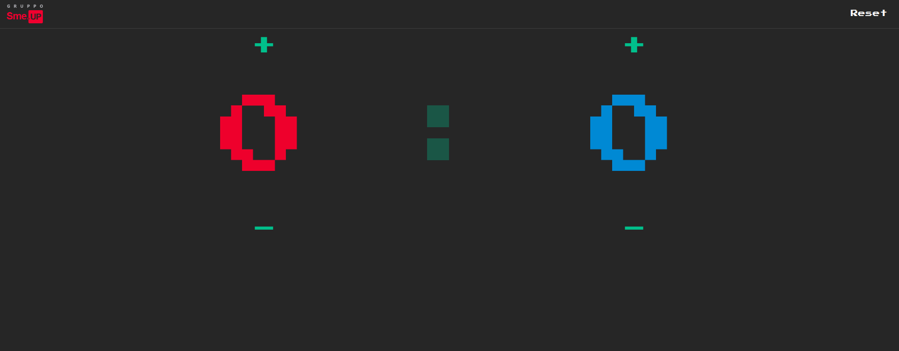
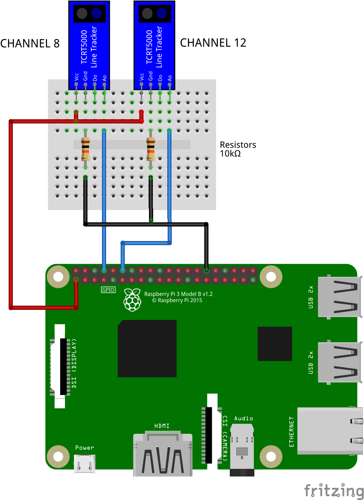
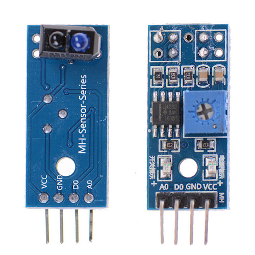

# SmeFootballScore_pi

A simple web 'table score' for 'table football', designed to run on [Raspberry Pi](https://www.raspberrypi.org/).

Two IR sensors (TCRT5000), connected to Raspberry, detect goals and notify the web page to increase team score properly.

Any client connected to web page will be notified about score changes, due to websocket ([socket.io](https://socket.io/)) technology.

Score can be manually increased or decreased by 'plus-minus' and cleared by 'Reset' link.



**Connection schema**



**TCRT5000 IR Sensor**



## Installing

**(Python 3.6 or above required)**

From project root create virtual environment, activate and install requirements:

```sh
~/SmeFootballScore_pi$ python -m venv venv
~/SmeFootballScore_pi$ source venv/bin/activate
~/SmeFootballScore_pi$ pip install -r requirements.txt
```

## Running

__as app__

```sh
export FLASK_APP=flaskr
flask run
```

__as wsgi server__

```sh
gunicorn --worker-class eventlet -w 1 -b localhost:8080 wsgi
```

## Deployment

As seen above (gunicorn...)


## License

This project is licensed under the MIT License
